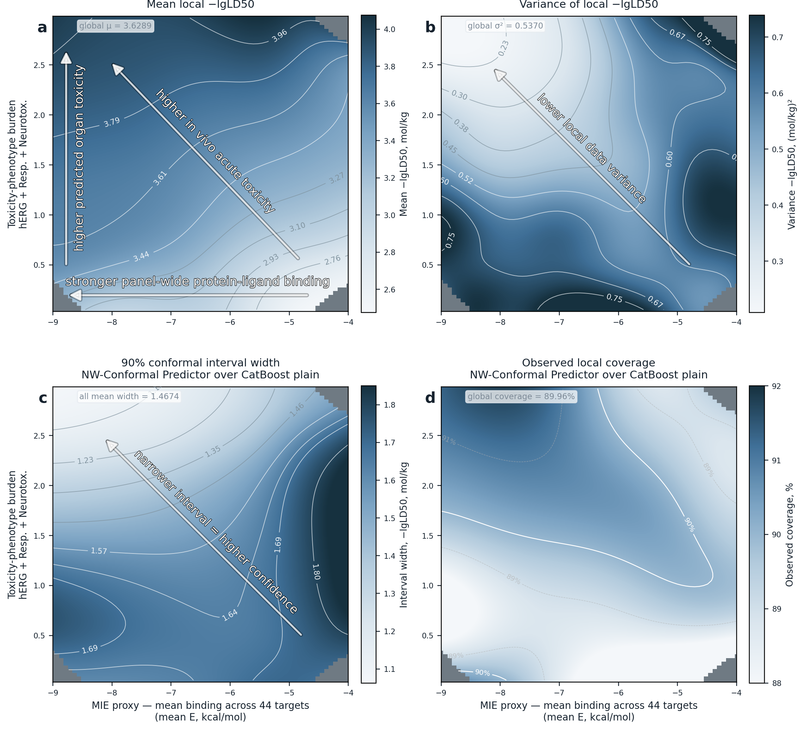

# Biology-Informed Confidence Model for Toxicological QSAR

This repository reproduces the figures, tables, and article PDF for a
biology-informed acute toxicity QSAR workflow. The analysis combines molecular
fingerprints, physicochemical descriptors, protein docking scores, ADMET-derived
annotations, CatBoost regression, SHAP interpretation, and localized conformal
prediction.

## Project Structure

```text
├── data/
│   ├── df_final.csv                         # Canonical processed dataset
│   ├── excluded_molecules.csv               # Exclusion registry
│   └── receptor_panel_annotation.csv        # Protein-panel annotation
├── notebooks/                               # Reproducible notebook workflow
├── results/
│   ├── figures/                             # Generated figure outputs
│   ├── models/                              # Trained CatBoost model pickles
│   ├── splits/
│   │   ├── split_indices.csv                # Unified split registry
│   │   ├── train.csv                        # Active model-training IDs
│   │   ├── val.csv                          # Active validation IDs
│   │   └── test.csv                         # Active test IDs
│   └── tables/                              # Metrics, predictions, manifests
├── .gitignore
└── requirements.txt
```

## Features

### Input Features

- **Molecular descriptors**: molecular weight and logP.
- **Molecular fingerprints**: 2048-bit Morgan fingerprints.
- **Protein docking scores**: docking energies for 44 safety-relevant protein targets.
- **ADMET descriptors**: ADMETLab-derived descriptor and ADME feature block.
- **Toxicity-phenotype coordinates**: hERG, respiratory toxicity, and drug-induced neurotoxicity predictions used for local conformal calibration.

### Models

1. **Baseline**: molecular descriptors + fingerprints + 44 docking scores.
2. **PCA**: molecular descriptors + fingerprints + three PCA components of the docking panel.
3. **ADME**: Baseline plus ADMET descriptor features.
4. **Plain**: molecular descriptors + fingerprints only.
5. **BBB pass**: Baseline evaluated within the BBB-permeant subdomain.

### Split Registry

All split assignments are stored in one CSV file:

```text
results/splits/split_indices.csv
```

The file has only three columns:

```text
split_index,set,ligand_id
```

- `split_index=0` is the reference tox_v1 train/test split used for the local confidence landscape.
- `split_index=1` is the active group-holdout split used for the five-model comparison.
- `split_index=2..30` are additional group-holdout repeats for robustness checks.

### Confidence Model

The point predictor for the confidence landscape is deliberately structural: it
uses only fingerprints, molecular weight, and logP. Docking scores and selected
toxicity-phenotype outputs are used separately to calibrate local conformal
prediction intervals in a biological context space.

## Installation

```bash
python -m venv .venv
source .venv/bin/activate
pip install -r requirements.txt
```

The notebooks expect the processed dataset at:

```text
data/df_final.csv
```

## Usage

Run notebooks in numeric order from `notebooks/`.

### 1. Data Inventory

- Validates `data/df_final.csv`.
- Records feature groups, docking-score missing values, and support files.

### 2. Model Training

- Loads `split_index=1` from `results/splits/split_indices.csv`.
- Trains the five CatBoost model variants.
- Computes holdout metrics and global conformal interval metrics.
- Saves trained models and prediction tables.

### 3. Performance Figures

- Generates Fig. 1 and Fig. 2 in the final colorblind-safe article style.
- Displays the generated figures directly inside the notebook.

### 4. SHAP Interpretation

- Computes SHAP values from the trained models.
- Generates the grouped feature-importance matrix and detailed SHAP summaries.
- Displays all generated SHAP figures directly inside the notebook.

### 5. Local Confidence Landscape

- Loads `split_index=0` from `results/splits/split_indices.csv`.
- Retrains the structural Plain point predictor for the confidence experiment.
- Computes local 90% conformal interval widths.
- Builds the toxicity-phenotype / docking-burden confidence landscape.
- Generates the quadrant summary table and displays the landscape figure.

### 6. Article Export

- Writes generated LaTeX table fragments and number macros.
- Copies final generated figures into the PDF build workspace.
- Displays article figures directly inside the notebook.

### 7. Verification and PDF Build

- Verifies required files, figures, generated tables, and source cleanliness.
- Builds the article PDF with `pdflatex -> bibtex -> pdflatex -> pdflatex`.

## Results

### Model Performance

| Model | RMSE | MAE | R² | Spearman | CCC | 90% PI |
|---|---:|---:|---:|---:|---:|---:|
| Baseline | 0.520 | 0.359 | 0.486 | 0.697 | 0.659 | 1.625 |
| PCA | 0.517 | 0.360 | 0.492 | 0.700 | 0.661 | 1.651 |
| ADME | 0.509 | 0.349 | 0.507 | 0.714 | 0.662 | 1.573 |
| Plain | 0.507 | 0.353 | 0.510 | 0.714 | 0.670 | 1.618 |
| BBB pass | 0.479 | 0.328 | 0.433 | 0.668 | 0.607 | 1.465 |

The BBB-pass model is evaluated on a filtered subdomain and should not be treated
as a universal replacement for the full-dataset models.

### Local Confidence Landscape

The localized conformal confidence model preserves approximately 90% test
coverage while making prediction intervals molecule- and region-specific.

The main result of this work is a conformal confidence model operating on top of
the primary toxicity predictor: it distinguishes regions where prediction errors
are expected to be larger from regions where they are expected to be smaller.

<p align="center">
  
</p>

| Quantity | Value |
|---|---:|
| Model-training molecules | 8096 |
| Calibration molecules | 2024 |
| Held-out test molecules | 2530 |
| Structural point-predictor RMSE | 0.5006 |
| Local 90% coverage | 89.96% |
| Mean local 90% interval width | 1.463 |
| Median local 90% interval width | 1.509 |
| **Approximate map range of interval width** | **1.14-1.85** |

### Key Findings

- Structural fingerprints plus simple physicochemical descriptors remain a strong global baseline.
- Direct docking-score addition does not automatically improve global point-prediction accuracy.
- ADMET descriptors are useful but change the explanation language toward descriptor-level effects.
- Docking-derived and toxicity-phenotype coordinates are useful as a biological applicability-domain space for local confidence estimation.

## Configuration

The workflow is a set of sequentially executed notebooks. Constants, feature definitions, model parameters,
paths, and plotting settings are defined directly in the corresponding notebooks.
All paths are relative to the repository root.

## Citation

If you use this workflow in your research, please cite:

```text
[coming soon]
```

## License

MIT License

## Contact

For questions or issues, please contact safronov [dog] phystech.edu.
